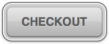

# DevBros - Coding Challenge

The following is a frontend orientated coding challenge, designed to give us a sense of how you write code and solve problems.

There is a sample JSON response file in this folder, bikes_response.json.
We would like you to use HTML, CSS and Javascript to pull the JSON content and display the data in an organized way. In addition, you should add in a sorting (column headers) and searching mechanic to the front-end. Feel free to use any frameworks you would like to achieve the task.
 \*Third party tools that do all the logic for sorting/searching for you are disencouraged.

In addition to the above, using CSS, we would like you to replicate (or as close as you can get) the styling of the button below on at least 1 button on the page.

\*Checkout is just placeholder text
